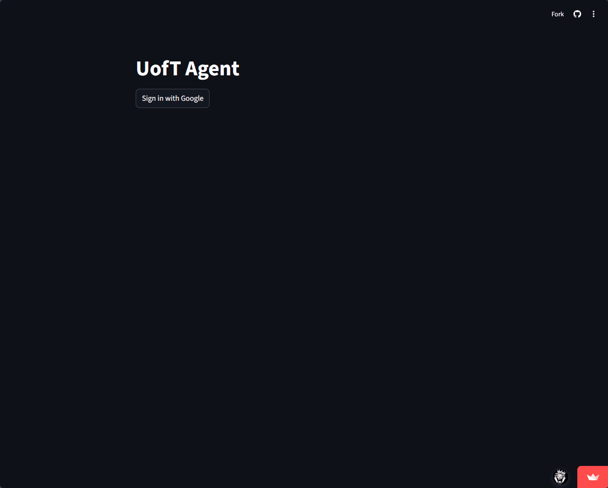

<div align="center">

# UofT Agent

AI academic assistant for University of Toronto students.



</div>

## Live App

https://uoft-agent.com/

## Chrome Extension

UofT Agent Connector is published on the Chrome Web Store:

https://chromewebstore.google.com/detail/akchfgkjeenfkmcommdpnimgkbnclgfa?utm_source=item-share-cb

## What It Does

UofT Agent combines live academic data, deterministic grade math, and an Anthropic tool-calling loop.

Current capabilities:

- Quercus course retrieval
- Encrypted Quercus-token persistence per logged-in user
- Assignment and submission retrieval
- Canvas assignment-group weight resolution
- Syllabus PDF, DOCX, and Canvas-page discovery when Canvas weights are missing
- Current-grade and target-grade calculations
- Dashboard cards, announcements, deadlines, and per-course what-if views
- ACORN academic-history import via browser extension and backend API
- Published Chrome Web Store extension for ACORN academic-history import

## Core Flow

1. The student signs in with Google through the deployed FastAPI + React flow.
2. On first use, the student enters a Quercus personal access token.
3. The app validates the token, encrypts it, and stores it in Supabase for that logged-in user.
4. On later visits, the app restores the saved token automatically and skips the token prompt.
5. The app loads current courses and grade data from Quercus.
6. If Canvas weights are missing, the app searches for a syllabus and extracts weights with Anthropic.
7. Deterministic Python code computes grades and scenarios.
8. The chat agent can call the same tools to answer natural-language questions.

## Project Structure

- [`app.py`](/C:/Users/armaa/OneDrive/Documents/Armaan/UofT/uoft-agent/app.py) — Streamlit UI, dashboard, chat, ACORN tab
- [`auth/user_store.py`](/C:/Users/armaa/OneDrive/Documents/Armaan/UofT/uoft-agent/auth/user_store.py) — Supabase-backed user lookup and encrypted Quercus-token persistence
- [`agent/agent.py`](/C:/Users/armaa/OneDrive/Documents/Armaan/UofT/uoft-agent/agent/agent.py) — Anthropic agent loop
- [`agent/tools.py`](/C:/Users/armaa/OneDrive/Documents/Armaan/UofT/uoft-agent/agent/tools.py) — tool schemas and dispatch
- [`calculator/grades.py`](/C:/Users/armaa/OneDrive/Documents/Armaan/UofT/uoft-agent/calculator/grades.py) — deterministic grade engine
- [`integrations/quercus.py`](/C:/Users/armaa/OneDrive/Documents/Armaan/UofT/uoft-agent/integrations/quercus.py) — Quercus / Canvas API client
- [`integrations/syllabus.py`](/C:/Users/armaa/OneDrive/Documents/Armaan/UofT/uoft-agent/integrations/syllabus.py) — syllabus discovery and parsing
- [`integrations/syllabus_cache.py`](/C:/Users/armaa/OneDrive/Documents/Armaan/UofT/uoft-agent/integrations/syllabus_cache.py) — persistent Supabase cache for parsed syllabus weights
- [`api_server.py`](/C:/Users/armaa/OneDrive/Documents/Armaan/UofT/uoft-agent/api_server.py) — ACORN import backend
- [`uoft-acorn-extension/`](/C:/Users/armaa/OneDrive/Documents/Armaan/UofT/uoft-agent/uoft-acorn-extension) — Chrome extension, published on the Chrome Web Store

## Auth

The app uses Streamlit's built-in auth APIs:

- `st.login("google")`
- `st.user`
- `st.logout()`

This is not a Supabase Auth flow and not a custom auth module.

If you still run the legacy Streamlit app, configure secrets like this:

```toml
ANTHROPIC_API_KEY = "..."
SUPABASE_URL = "..."
SUPABASE_KEY = "..."
ENCRYPTION_KEY = "..."

[auth]
redirect_uri = "https://uoft-agent.com/oauth2callback"
cookie_secret = "..."

[auth.google]
client_id = "..."
client_secret = "..."
server_metadata_url = "https://accounts.google.com/.well-known/openid-configuration"
```

Important:

- App secrets such as `ANTHROPIC_API_KEY` must stay at the top level
- Do not place them under `[auth]` or `[auth.google]`
- The app also uses `SUPABASE_URL`, `SUPABASE_KEY`, and `ENCRYPTION_KEY` to persist encrypted Quercus tokens

## Local Development

Install dependencies:

```bash
pip install -r requirements.txt
```

Create a local `.env`:

```env
ANTHROPIC_API_KEY=your_anthropic_key
QUERCUS_API_TOKEN=your_quercus_token
SUPABASE_URL=https://your-project.supabase.co
SUPABASE_KEY=your_supabase_service_role_key
ENCRYPTION_KEY=your_fernet_key
```

Run the Streamlit app:

```bash
streamlit run app.py
```

Run the ACORN backend locally:

```bash
python api_server.py
```

## Deployment

Recommended split:

- Streamlit app on Streamlit Cloud
- ACORN backend on Railway
- ACORN import storage in Supabase Postgres
- User records and encrypted Quercus tokens in Supabase Postgres
- Persistent parsed syllabus weights in Supabase Postgres

The backend supports:

- `POST /api/acorn/import`
- `GET /api/acorn/latest?import_code=...`
- `GET /api/acorn/status?import_code=...`

The Railway entrypoint is [`Procfile`](/C:/Users/armaa/OneDrive/Documents/Armaan/UofT/uoft-agent/Procfile):

```text
web: python api_server.py
```

## Notes On Grade Resolution

- Canvas `group_weight` is preferred whenever it exists
- Syllabus parsing is a fallback for courses with incomplete LMS metadata
- The syllabus fallback can now parse linked Canvas pages in addition to PDFs and DOCX files
- Weighted overview grades are shown only when the component mapping is reliable enough
- Module-based syllabus discovery now prefers actual file metadata and can deterministically select a unique best candidate before falling back to an LLM chooser
- Assignment groups and submissions are cached for 5 minutes to improve dashboard performance
- Parsed syllabus weights are cached for 1 hour in-process and also persisted in Supabase for reuse across sessions

## Current Limitations

- Gradescope and MarkUs integrations are still placeholders
- Some courses intentionally show no weighted overview grade when syllabus-to-assignment mapping is too ambiguous
- ACORN import currently uses import codes rather than a full user account model
- The Streamlit ACORN tab is currently shown as a "Coming Soon" placeholder while the extension flow is under review
- If a saved Quercus token is revoked or expires, the app clears it and asks the user to enter a new one
- Quercus-posted grade changes can take up to about 5 minutes to appear because of short-lived API caching

## Support

Found a bug or have a question? Email armaanrehmanshah1@gmail.com
or [open an issue](https://github.com/armaan204/uoft-agent/issues).

## License

MIT. See [`LICENSE`](/C:/Users/armaa/OneDrive/Documents/Armaan/UofT/uoft-agent/LICENSE).
