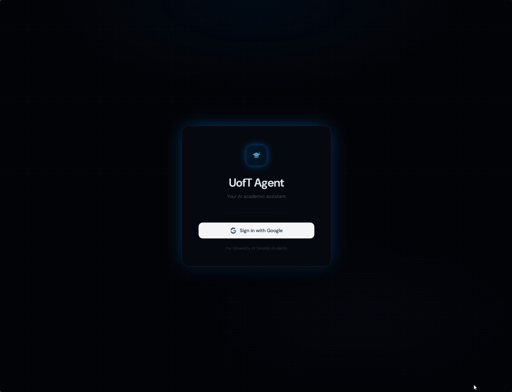

<div align="center">

# UofT Agent

AI academic assistant for University of Toronto students.

[](https://github.com/armaan204/uoft-agent/actions)



</div>

## 🚀 Live App

**[uoft-agent.com](https://uoft-agent.com/)** — create an account or sign in with Google, then connect your Quercus token to get started.

**[Chrome Extension](https://chromewebstore.google.com/detail/akchfgkjeenfkmcommdpnimgkbnclgfa?utm_source=item-share-cb)** — import your ACORN academic history in one click.

---

## 🤔 What It Does

Stop juggling Quercus, ACORN, and a calculator at the same time. UofT Agent pulls your live course data, does the grade math for you, and gives you an AI that actually knows your marks.

**📊 Dashboard**
- All your current courses in one place with live grade breakdowns
- Upcoming deadlines and recent announcements side-by-side
- Grades load instantly even on a new device or incognito tab (3-tier cache: memory → Supabase snapshot → live Quercus fetch)
- Hit refresh any time; existing data stays visible while the update runs in the background

**📝 Per-Course Grade Detail**
- Full weighted breakdown by component (assignments, midterms, finals, etc.)
- What-if sliders — drag to see what you need on the final to hit your target grade
- Inline grade editing: override any component score directly in the UI; changes persist across devices
- Syllabus weights auto-extracted from Canvas assignment groups or, if missing, from your course syllabus PDF/DOCX/page via Claude

**🤖 AI Chat**
- Ask anything: *"What do I need on my CSCA48 final to keep an A?"*, *"How are my grades across all courses?"*, *"Any announcements I missed this week?"*
- Threaded conversations with full history — pick up where you left off
- Claude uses deterministic tool calls for grade math; it never guesses your percentages
- Announcement detail loads in-app — no jumping to Quercus

**🎓 ACORN Import**
- Install the Chrome extension, open your ACORN page, click import — done
- Sessional and cumulative GPA over time with an interactive chart
- Sortable course table with every grade you've ever gotten at UofT
- Total earned credits (IPR and NGA excluded so the number actually makes sense)
- Transfer credits and CR/NCR courses handled correctly

**🗺️ Degree Planner** *(UTSC)*
- Paste your program name → the app finds your calendar page, extracts requirements with Claude, and matches them against your ACORN history
- Handles required courses, credit-from-list requirements, and open-pool department/level filters
- Co-op programs: work term requirements tracked separately from academic requirements
- No double-counting — each course satisfies at most one requirement slot

---

## ⚡ How It Works

1. Create an account with email/password, or sign in with Google
2. Paste your Quercus personal access token (Settings → Profile → Approved Integrations)
3. The app encrypts it and stores it in Supabase so you never have to paste it again
4. Dashboard loads automatically — grades, deadlines, announcements
5. Install the Chrome extension and import your ACORN history for GPA tracking + Degree Planner
6. Chat with the AI about anything academic

---

## 🏗️ Architecture

```
frontend/          Vite + React  →  uoft-agent.com
api/               FastAPI       →  email/password auth, Google OAuth, grades, chat, ACORN, graduation
agent/             Anthropic tool-calling loop (no LangChain)
calculator/        Deterministic grade engine + UofT GPA mapping
integrations/      Quercus client, syllabus parser, graduation service, ACORN store
auth/              Supabase-backed user + encrypted token persistence
uoft-acorn-extension/   Manifest V3 Chrome extension (published on Web Store)
```

Key FastAPI routes:

| Method | Route | What it does |
|--------|-------|-------------|
| `POST` | `/auth/signup` | Create an email/password account |
| `POST` | `/auth/login` | Sign in with email/password |
| `GET` | `/auth/google` | Start Google OAuth |
| `GET` | `/auth/me` | Current user info |
| `GET` | `/api/courses/dashboard` | Courses + deadlines + announcements |
| `GET` | `/api/courses/{id}/grades` | Full grade breakdown |
| `POST` | `/api/courses/{id}/grade-overrides` | Save a score override |
| `GET` | `/api/courses/{id}/scenarios` | What-if target grade scenarios |
| `POST` | `/api/chat` | Run AI agent, persist exchange |
| `GET` | `/api/chat/history` | All past conversations |
| `GET` | `/api/graduation/progress` | Degree planner analysis |

---

## 🛠️ Local Development

```bash
# Python backend
pip install -r requirements.txt

# Create .env
ANTHROPIC_API_KEY=...
SUPABASE_URL=...
SUPABASE_KEY=...
SUPABASE_ANON_KEY=...
ENCRYPTION_KEY=...
JWT_SECRET=...
GOOGLE_CLIENT_ID=...
GOOGLE_CLIENT_SECRET=...
REDIRECT_URI=http://localhost:8001/auth/callback
FRONTEND_URL=http://localhost:5173
PASSWORD_RESET_REDIRECT_URL=http://localhost:5173/auth/reset-password

# Run FastAPI
uvicorn api.main:app --reload --port 8001
# Swagger UI → http://localhost:8001/docs

# Run React frontend
cd frontend
npm install
npm run dev
# → http://localhost:5173
```

## 🧪 Tests

```bash
python -m coverage run -m pytest tests/ -q
python -m coverage report
```

813 tests, 100% coverage.

---

## ⚠️ Current Limitations

- Some courses show no weighted overview grade when the syllabus-to-assignment mapping is too ambiguous to trust
- Quercus-posted grade changes can take a few minutes to appear due to short-lived caching
- Degree Planner currently supports UTSC calendar pages only (UTM and St. George coming later)
- The auth JWT lives in localStorage for now — fine for development, not the final hardened auth posture

---

## 💬 Support

Found a bug or have a feature request? [Open an issue](https://github.com/armaan204/uoft-agent/issues) or email uoftagent@gmail.com.

## 📄 License

MIT. See [`LICENSE`](LICENSE).
